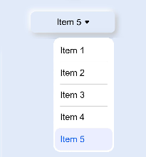

# Neumorphism_Dropdown

一Neumorphism Dropdown design for OpenHarmony.

## Download & Install

Install using npm

```npm i hmos-neumorphism ```
Details about OpenHarmony NPM environment configuration, see at [here](https://gitee.com/openharmony-tpc/docs/blob/master/OpenHarmony_npm_usage.md)

## Usage Instructions

# Dropdown



Import:
```html
<element name='neudropdown' src='hmos-neumorphism/dropdown/dropdown.hml'></element>
```

Usage:
```html
<neudropdown width="200px" height="50px" border="10px" @change-event="dropdownSelect">
  <select @change="dropdownSelect">
    <option value="Item 1">Item 1</option>
    <option value="Item 2">Item 2</option>
    <option value="Item 3">Item 3</option>
    <option value="Item 4">Item 4</option>
    <option value="Item 5" selected="true">Item 5</option>
  </select>
</neudropdown>
```
## Compatibility
Supports OpenHarmony API version 6 

## Directory Structure
````
|---- Neumorphism  
|     |---- entry  # sample app usage
|     |---- Neumorphism  # Neumorphism library
|           |---- dropdown  # Dropdown Component
|                 |---- dropdown.css  # Dropdown style component
|                 |---- dropdown.hml  # Dropdown hml file
|     |---- README.MD  # installation and usage                   
````
## Code Contribution
If you find any problems during usage, you can submit an [Issue](https://gitee.com/openharmony-sig/Dropdown/issues) to us. Of course, we also welcome you to send us [PR](https://gitee.com/openharmony-sig/Dropdown/pulls).

## Open source License
This project is based on [Apache License 2.0](https://gitee.com/openharmony-sig/Dropdown/blob/master/LICENSE.txt) ，please enjoy and participate in open source freely.

# Reference:

<a href="https://neumorphism.io/">neumorphism.io</a>

<a href="https://ismail9k.github.io/neomorphism/">ismail9k.github.io/neomorphism</a>
